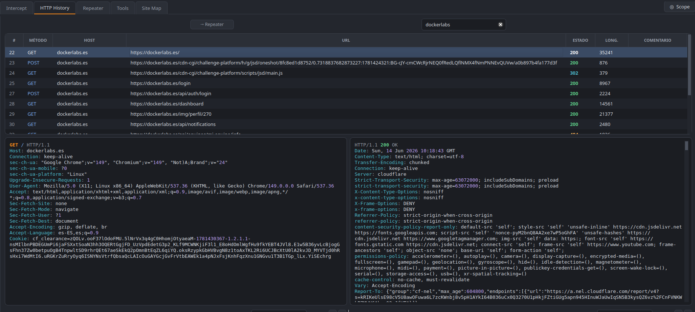
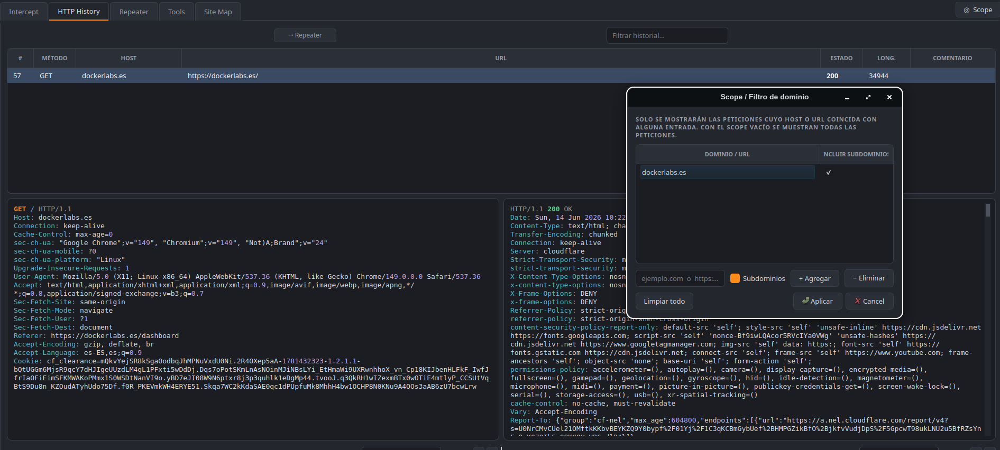
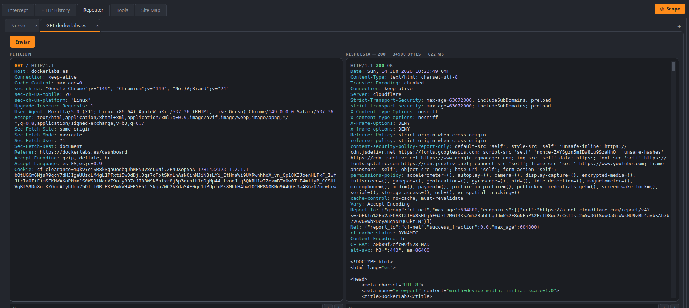
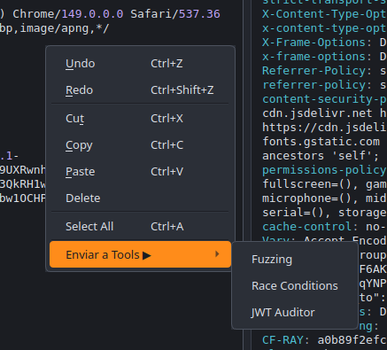
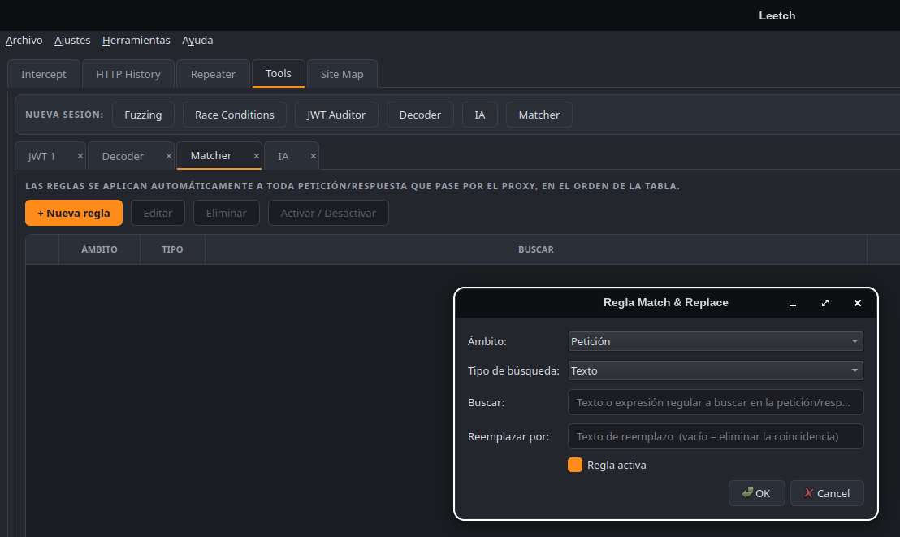
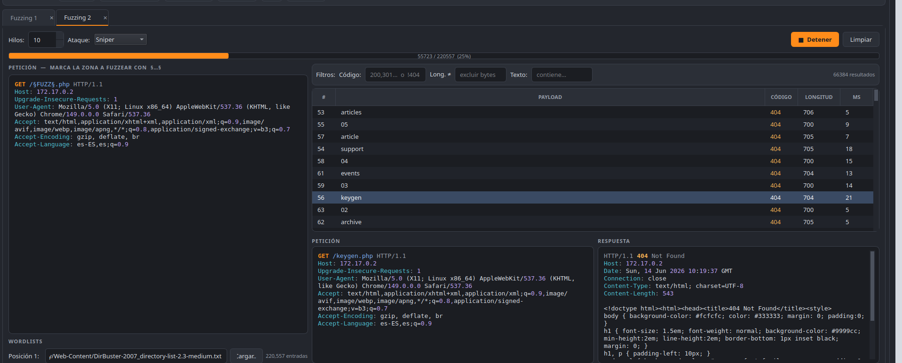
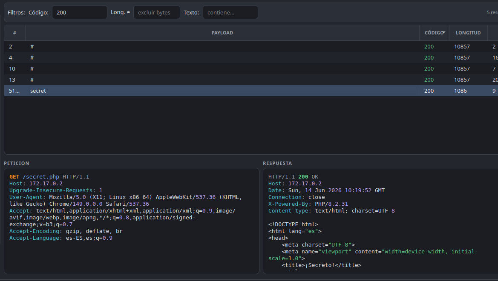
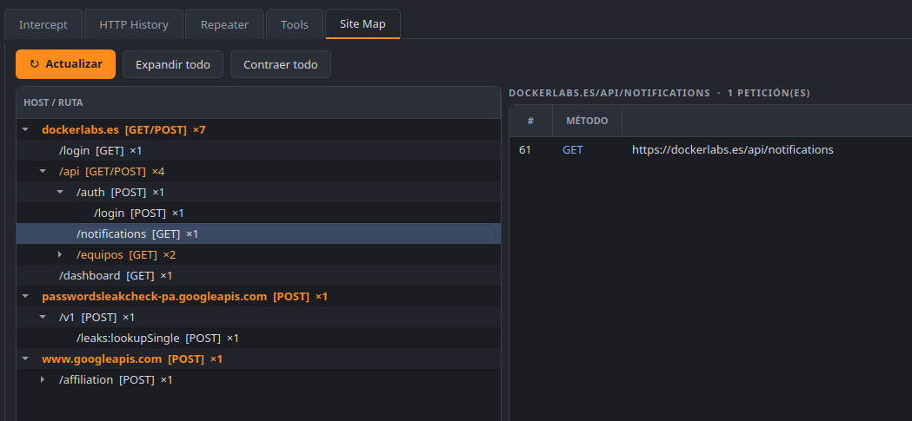

<p align="center">
  
</p>

<h1 align="center">Leetch</h1>
<p align="center">Proxy de interceptación HTTP/HTTPS para pentesting web</p>

---

## Instalación

### Linux — repositorio APT (recomendado)

```bash
echo "deb [trusted=yes arch=amd64] https://maalfer.github.io/leetch stable main" \
  | sudo tee /etc/apt/sources.list.d/leetch.list
sudo apt update
sudo apt install leetch
```

### Linux — paquete .deb

Descarga el `.deb` de la [última release](https://github.com/Maalfer/leetch/releases/latest):

```bash
sudo apt install ./leetch_*.deb
```

### Windows

Descarga e instala `LeetchSetup-*.exe` desde la [última release](https://github.com/Maalfer/leetch/releases/latest).

### macOS

Descarga `Leetch-*.dmg` desde la [última release](https://github.com/Maalfer/leetch/releases/latest), ábrelo y arrastra la app a Aplicaciones.

---

## Desde el código fuente (todas las plataformas)

Requiere **Python 3.10+**.

```bash
git clone https://github.com/Maalfer/leetch.git
cd leetch

# Crear entorno virtual
python3 -m venv .venv
source .venv/bin/activate      # Linux / macOS
# .venv\Scripts\activate       # Windows

# Instalar dependencias
pip install -r requirements.txt

# Arrancar
python3 main.py
```

---

## Uso

El proxy escucha en `127.0.0.1:8080` por defecto. Configúralo en tu navegador
o usa el navegador integrado (**Ajustes → Abrir navegador**).

### Certificado CA

Al arrancar por primera vez Leetch genera una CA propia en `~/.leetch/`.
Para interceptar HTTPS sin avisos: **Ajustes → Instalar CA** (lo hace automáticamente
en el sistema y en el perfil del navegador integrado).

---

## Módulos

### HTTP History

Registro completo de todo el tráfico interceptado. Cada fila muestra método,
URL, código de respuesta, tamaño y timestamp. Al seleccionar una petición se
muestran la request y la response con resaltado de sintaxis y barra de búsqueda
propia en cada panel.



**Opciones del menú contextual (clic derecho sobre una fila):**
- **Enviar al Repeater** — abre la petición en una pestaña de Repeater para editarla y reenviarla.
- **Enviar a Tools** — manda la petición directamente a Fuzzing, Race Conditions o JWT Auditor.
- **Copiar como curl** — genera el comando `curl` equivalente.
- **Etiquetas** — colorea la fila (rojo, naranja, amarillo, verde, azul, morado) para marcar peticiones de interés.
- **Comentario** — añade una nota libre a la petición.

#### Scope / Filtro de dominio

Pulsa el botón **Scope** (esquina superior derecha) para definir qué dominios
aparecen en el historial. Con el scope vacío se muestra todo el tráfico.
Puedes incluir subdominios con el checkbox correspondiente.



---

### Repeater

Edita y reenvía peticiones HTTP crudas con respuesta en tiempo real.
Cada pestaña es independiente. Usa `Ctrl+Intro` para enviar.

Cada panel (petición y respuesta) tiene su propia barra de búsqueda con
navegación ↑↓ y wrap-around.



Desde el **menú contextual** del editor de petición puedes mandar la request
directamente a Fuzzing, Race Conditions o JWT Auditor:



---

### Tools

Agrupa todas las herramientas ofensivas. La fila **Nueva sesión** abre pestañas
independientes para Fuzzing, Race Conditions y JWT Auditor.
Decoder, IA y Matcher son herramientas singleton accesibles desde la misma fila.



#### Fuzzing

Fuzzer HTTP con soporte de múltiples modos de ataque:

| Modo | Descripción |
|---|---|
| **Sniper** | Un marcador, una wordlist |
| **Pitchfork** | N marcadores, N wordlists en paralelo (zip) |
| **Cluster Bomb** | N marcadores, producto cartesiano de N wordlists |

Marca la zona a fuzzear con `§…§` en la petición. Múltiples pares de marcadores
activan automáticamente las filas de wordlist correspondientes.

Los resultados se filtran en tiempo real por **código de respuesta**, **longitud**
y **texto contenido**. Clic en cualquier fila para ver la petición y respuesta completas.





#### Race Conditions

Lanza N peticiones simultáneas al mismo instante para explotar condiciones de
carrera (descuentos, transferencias, consumo de tokens de un solo uso, etc.).
Configura el número de peticiones y pulsa **Lanzar**.

#### JWT Auditor

- **Decodificación** automática del header, payload y firma al pegar el token.
- **Bruteforce del secreto** con soporte HS256, HS384 y HS512 (modo Auto prueba los tres).
  Ejecuta en paralelo con hasta 50 hilos configurables para mayor velocidad.

#### Decoder

Cadena de transformaciones aplicadas en orden: Base64, URL encode/decode,
HTML entities, Hex, MD5, SHA-1, SHA-256, SHA-512. Añade y elimina pasos
con los botones + / −. También incluye un inspector JWT integrado con
soporte para ataque `alg:none` y re-firma HS256.

#### Matcher (Match & Replace)

Define reglas que se aplican automáticamente a **toda** petición o respuesta
que pase por el proxy, en orden de tabla. Cada regla especifica:

- **Ámbito**: Petición o Respuesta.
- **Tipo**: texto literal o expresión regular.
- **Buscar / Reemplazar**: el texto a encontrar y su sustitución (vacío = eliminar).

Útil para inyectar cabeceras, sustituir tokens, modificar User-Agent, etc.

#### IA

Terminal del sistema embebida que arranca automáticamente al abrir la pestaña.
Antes de lanzar la shell genera un directorio de contexto con:

- `CLAUDE.md` — descripción completa de Leetch y sus herramientas, más un
  índice de todo el HTTP History interceptado.
- `http_history/flow_NNNN.http` — un fichero por petición con la request y
  la response completas (ya descomprimidas).

La shell arranca en ese directorio, así que al ejecutar `claude` (Claude Code)
lee el contexto automáticamente y puede analizar el tráfico para ayudarte en
la auditoría.

El botón **Terminal del sistema** abre el mismo directorio en tu emulador
nativo (gnome-terminal, konsole, xterm…) para usar la IA a pantalla completa.

---

### Site Map

Árbol visual de todos los hosts y rutas descubiertos durante la sesión.
Al clicar en un nodo se muestran todas las peticiones asociadas a esa ruta
y sus descendientes. Doble clic en una fila para abrirla en el Repeater.



---

## Estructura del proyecto

```
main.py          entrypoint
proxy/           servidor MITM (CA, flows, intercept, match & replace)
net/             cliente HTTP y parser de mensajes
ui/              interfaz (PySide6)
  assets/        logo e iconos
docs/
  screenshots/   capturas de pantalla
session.py       guardado y restauración de sesión (.json)
```

## Sesión

Guarda y restaura todo el historial, las pestañas del Repeater y las etiquetas:

- **Archivo → Guardar sesión…** (`Ctrl+S`)
- **Archivo → Cargar sesión…** (`Ctrl+O`)
